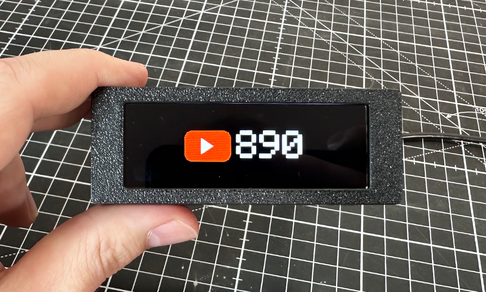
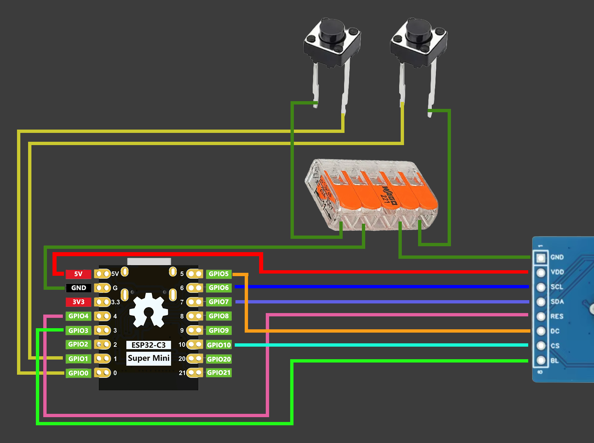

# Subscriber Display

<p align="center">
  
</p>

A compact Wi-Fi connected YouTube subscriber display based on an **ESP32-C3 SuperMini** and a **2.79" NV3007 142×428 display**.

The device connects to Wi-Fi, retrieves YouTube channel statistics using the YouTube Data API and displays the current subscriber count. Configuration is handled through a built-in web interface, so Wi-Fi credentials and device settings do not need to be hardcoded into the firmware.

---
## Features

- YouTube subscriber counter
- YouTube channel name display
   - Optional clock display
     Long and abbreviated subscriber count formats
    - `10.000`
    - `10k`
- Configurable display brightness
- Configurable foreground and background colors
- Wi-Fi setup through a captive portal
- DHCP or static IP configuration
- Configurable device hostname
- Web-based configuration interface
- Light Sleep mode
- Deep Sleep / shutdown mode
- Two hardware buttons
- Button swapping through software
- Settings stored persistently on the ESP32

---
## Youtube Video

* Make sure to check out the video for this project!

---
## Hardware

### Required Components

- ESP32-C3 SuperMini
- 2.79" NV3007 TFT display
    - Resolution: 142 × 428 px
- 2 × push buttons
- Suitable 5 V power supply

---
## 3D Printed Parts

* Printables

---
## Wiring

### Wiring Diagram
<p align="center">
  
</p>

### Pin Connections

#### Display

| TFT Pin | ESP32-C3 |
| ------- | -------- |
| GND     | GND      |
| VDD     | 5V       |
| SCL     | GPIO 6   |
| SDA     | GPIO 7   |
| RES     | GPIO 4   |
| DC      | GPIO 5   |
| CS      | GPIO 10  |
| BL      | GPIO 3   |
The backlight (`BL`) is connected to GPIO 3 and controlled using PWM.

#### Buttons

| Function | ESP32-C3 | Connection                    |
| -------- | -------- | ----------------------------- |
| Button A | GPIO 0   | Button between GPIO 0 and GND |
| Button B | GPIO 1   | Button between GPIO 1 and GND |

The firmware uses the ESP32's internal pull-ups, so no external pull-up resistors are required for the buttons.

---

# Arduino IDE Setup

## 1. Install ESP32 Board Support

Open:

**Arduino IDE → Tools → Board → Boards Manager**

Search for:

```
esp32
```

Install:

**esp32 by Espressif Systems**

A current **3.x release** is recommended.

---

## 2. Select the Board

Select the appropriate ESP32-C3 board configuration for your ESP32-C3 SuperMini.

For most ESP32-C3 SuperMini boards, an ESP32-C3 compatible board definition can be used.

> **TODO:** Add the exact Arduino IDE board selection and tested board settings here.

Example:

```
Board: ESP32C3 Dev Module
USB CDC On Boot: Enabled
Flash Size: 4MB
Partition Scheme: Huge APP
```

These settings should be documented according to the exact ESP32-C3 SuperMini version used for the project.

---

# Required Libraries

The following additional Arduino libraries must be installed before compiling the firmware.

* Arduino_GFX
	* Author: Moon On Our Nation / moononournation
* U8g2
	* Author: olikraus

---
## Libraries provided by the ESP32 Core

The firmware additionally uses the following libraries/components that are included with the ESP32 Arduino core and normally do **not** need to be installed separately:

```
WiFi
WebServer
DNSServer
ESPmDNS
Preferences
HTTPClient
WiFiClientSecure
esp_sleep
time
```

---

# Uploading the Firmware

After installing the ESP32 board package and the required libraries:

1. Connect the ESP32-C3 SuperMini to your computer.
2. Open `SubscriberDisplay.ino` in Arduino IDE.
3. Select the correct ESP32-C3 board.
4. Select the correct serial/USB port.
5. Verify/compile the sketch.
6. Upload the firmware to the ESP32.
    
After the first boot, the device starts its Wi-Fi setup mode automatically.

---
# Initial Wi-Fi Setup

If no Wi-Fi configuration has been stored, the Subscriber Display creates its own Wi-Fi access point.

The SSID has the following format:

```
SubscriberDisplay-XXXXXX
```
`XXXXXX` is generated from the ESP32's unique chip identifier.

## 1. Connect to the Setup Network

Using a phone, tablet or computer, connect to:

```
SubscriberDisplay-XXXXXX
```

No Wi-Fi password is configured by default.
The captive portal should open automatically.

---
## 2. Open the Setup Page Manually

If the captive portal does not open automatically, open a browser and navigate to:

```
http://192.168.4.1
```
This is the default IP address of the ESP32 access point used during initial setup.

---

## 3. Configure Wi-Fi

The setup page allows you to configure:

- Wi-Fi network
- Wi-Fi password
- DHCP or static IP
- Device hostname

The default hostname is:

```
subscriberdisplay
```

The corresponding default local address is:

```
http://subscriberdisplay.local
```

After saving the configuration, the ESP32 restarts and connects to the selected Wi-Fi network.

---

# Accessing the Web Interface

After the device has successfully connected to your Wi-Fi network, open:

```
http://subscriberdisplay.local
```

If the hostname was changed during setup, use:

```
http://<your-hostname>.local
```

For example:

```
http://mycounter.local
```

The device can alternatively be accessed using the IP address assigned by your router.

> `.local` access uses mDNS. Some networks, operating systems or network configurations may not resolve mDNS hostnames correctly. In this case, use the device's IP address instead.

---

# YouTube Configuration

The web interface allows the YouTube channel and API settings to be configured.

A **YouTube Data API key** is required.

> **How to get the API key:** https://developers.google.com/youtube/registering_an_application?hl=en

The channel can be configured using supported channel references such as:

```
@handle
```

or a YouTube channel ID:

```
UC...
```

The firmware also supports legacy YouTube usernames.

The default YouTube refresh interval is:

```
60 seconds
```

---

# Display Settings

The web interface provides configuration options including:

- YouTube channel
- YouTube API key
- Subscriber refresh interval
- YouTube logo visibility
- Subscriber number format
- Channel name display
- Clock display
- Time zone
- 12 / 24 hour clock
- Device name display
- Font style
- Font color
- Background color
- Display brightness

The default timezone is:

```
Europe/Vienna
```

---

# Button Controls

## Button 1

Button 1 controls the device's sleep functions.

### Short press

Enters:

```
Light Sleep
```

### Hold for 5 seconds

After releasing the button, the ESP32 enters:

```
Deep Sleep
```

Deep Sleep is used as the device's shutdown mode.

> Deep Sleep is not a true electrical power-off. The ESP32 remains powered but operates in its lowest-power sleep state.

---

## Button 2

A short press toggles the subscriber count format.

Example:

```
10.000
```

↔

```
10k
```

---

## Swap Buttons

The GPIO assignment of the two buttons can be swapped logically through the web interface.
This allows GPIO 0 and GPIO 1 to exchange their functions without changing the physical wiring.

---

# Network Configuration

By default, the device uses:

```
DHCP
```

A static network configuration can optionally be entered during the initial setup.

Default values shown by the setup interface are:

|Setting|Default|
|---|---|
|IP|`192.168.1.50`|
|Gateway|`192.168.1.1`|
|Subnet|`255.255.255.0`|
|DNS|`1.1.1.1`|

These values are only relevant when **Static IP** is selected.

---

# Factory Reset

The web interface provides a **Factory Reset** function.
A factory reset removes the stored device configuration and restarts the ESP32 in setup mode.
The Wi-Fi setup network will then become available again:

```
SubscriberDisplay-XXXXXX
```

Setup can be accessed at:

```
http://192.168.4.1
```

---

# Troubleshooting

## Setup page does not open

Connect to the device's Wi-Fi network and manually open:

```
http://192.168.4.1
```

---

## `subscriberdisplay.local` does not work

Try accessing the device through its local IP address instead.
mDNS (`.local`) resolution depends on the operating system and network configuration.

---

## Device cannot connect to Wi-Fi

Check:

- SSID
- Wi-Fi password
- Wi-Fi signal strength
- DHCP configuration
- Static IP settings, if enabled

If the saved Wi-Fi network cannot be reached during startup, the firmware automatically reopens the setup portal.

---

## YouTube subscriber count is not displayed

Check:

- Internet connection
- YouTube Data API key
- YouTube channel reference
- YouTube Data API configuration / quota

---

# Credits

This project uses:

- Arduino
- ESP32 Arduino Core by Espressif Systems
- Arduino_GFX Library by Moon On Our Nation
- U8g2 by olikraus
- YouTube Data API

---

## Disclaimer

This project is an independent project and is not affiliated with or endorsed by YouTube or Google.
YouTube is a trademark of Google LLC.